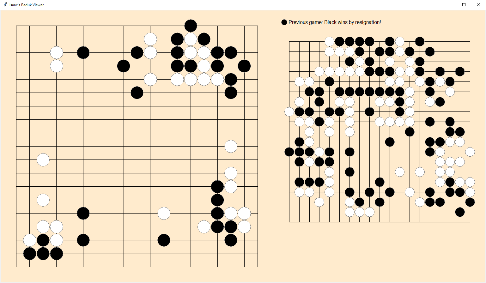

# baduk_sgf
Baduk SGF Viewer

I wrote this program to passively familiarize my son with baduk patterns in pro games, by having them continuously running on the side in the living room. 

The program pulls sgf files from the "badukmovies-pro-collection" folder, and steps through all the stone-placements in each game one-by-one, with a few seconds between each move. At the end of each game, it shows a block of white stones or black stones to indicate the winner (as dictated by the sgf file), and it shows the results of the last game. If no winner is indicated in the sgf, or it's a draw, it shows a block of half-black, half-white, and indicates that the winner is unknown or a draw.

The program keeps track of which game it showed last, so if you turn it off and on again then it will start with the next game in the folder, after the one it most recently opened.

The folder has just a few sgf files in it, but you can get like a year's worth of runtime by downloading the full collection from here: https://www.badukmovies.com/pro%5fgames .

The program walks the folders and parses for .sgf files, so you don't have to modify the folder structure that you get by downloading from badukmovies.

As of the last version, running on my raspberry pi, the program can now stay active for 2-3 months before needing to be reset. (I was going to update this after a few days if it worked well, but I forgot). I'll pull the latest from the pi later and post it here just to make sure that what's on github is what's actually working for me.

This program must be placed in the same directory as the "badukmovies-pro-collection" folder in order to work.
